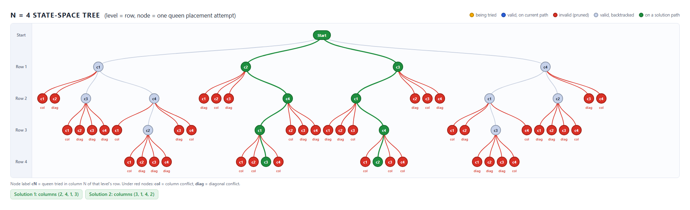

# Project Title

N-Queens Problem using Backtracking (Project 10 – N-Queens State Space Tree, N=4)

## Description

This project implements the **N-Queens problem using backtracking** for **N = 4** and visualizes the **state space tree** through prompt engineering. One queen is placed per row; every attempt to place a queen is a node of the tree, **invalid branches (column or diagonal conflicts) are marked in red**, and the recursive exploration with backtracking is shown level by level.

In addition to the static image, `Visualizer/index.html` is a self-contained animated visualizer (plain HTML/CSS/JavaScript, no server or installation) that replays the same backtracking search step by step on a 4×4 chessboard and on the tree.

Files: `Project10_NQueens.java` (algorithm), `Prompt.txt` (prompt), `Visualization.png` (state-space tree), `Visualizer/` (animated version).

## Algorithm

```text
procedure Solve(row):                    // N = 4, rows and columns numbered 1..N
    if row > N:
        record solution; return
    for col ← 1 to N:
        if IsSafe(row, col):
            place queen at (row, col)
            Solve(row + 1)               // recurse into the next row
            remove queen from (row, col) // BACKTRACK
        else:
            prune branch (invalid, red)

function IsSafe(row, col):
    for r ← 1 to row − 1:
        c ← column of the queen in row r
        if c = col or |c − col| = row − r:
            return false
    return true

Solve(1)
```

**Logic.** `Solve(row)` places exactly one queen in `row` by trying columns 1 to 4. A square is rejected as soon as it shares a column or a diagonal with a queen in an earlier row; that branch is pruned and nothing below it is explored. If the square is safe, the queen is placed and the search recurses into the next row. When the recursive call returns, the queen is removed (backtracking) and the next column is tried. Reaching `row = 5` means four non-attacking queens were placed, which is a solution.

**Result for N = 4:** 60 tree nodes explored (excluding Start), of which 44 are invalid (red) and 16 are valid, giving **2 solutions**: columns (2, 4, 1, 3) and (3, 1, 4, 2).

## Prompt Used

"Visualize the state space tree for N=4 queens, marking invalid branches in red."

Refinement added after the official prompt (full text in `Prompt.txt`): draw the complete tree with a Start root, one level per row, one node per column attempt, invalid branches in red labelled `col`/`diag`, and the two solution paths in green.

The prompt was given to an AI assistant (Claude Code), which generated the visualization from the real backtracking algorithm; `Visualization.png` is rendered from `Visualizer/index.html#full`.

## Output



**How backtracking is shown visually**

- Each level is one row, i.e. one recursive call `Solve(row)`; each node is one queen placement attempt (`cN` = column N).
- **Red nodes and edges** are invalid placements, labelled `col` (column conflict) or `diag` (diagonal conflict). They are leaves: the search is pruned there.
- A valid node with children shows the recursion going deeper. When all of its children are explored, the search returns to its parent (backtracks) and tries the next sibling.
- **Green paths** lead to the two solutions.

**Interactive version:** open `Visualizer/index.html` in any browser and click **Start**. Controls: Start, Pause, Next Step, Reset (and a speed slider). The board shows the queens, the tree grows as nodes are explored, and the status panel states the current row, column, action and reason. `Visualizer/index.html#full` shows the complete tree (the source of `Visualization.png`).

**Run the Java program**

```text
javac Project10_NQueens.java
java Project10_NQueens
```

## Learning Outcome

- Understood recursive backtracking.
- Learned prompt-based visualization.
- Practiced GitHub documentation.
